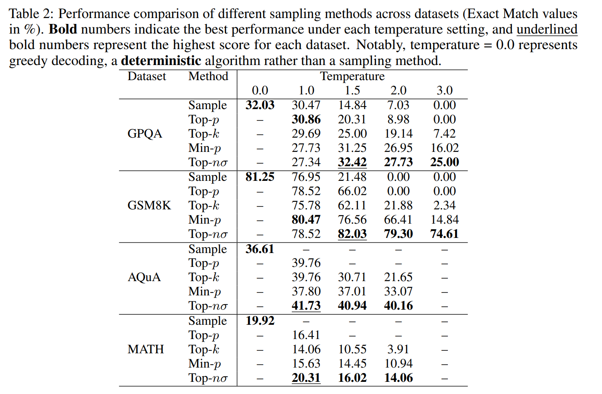
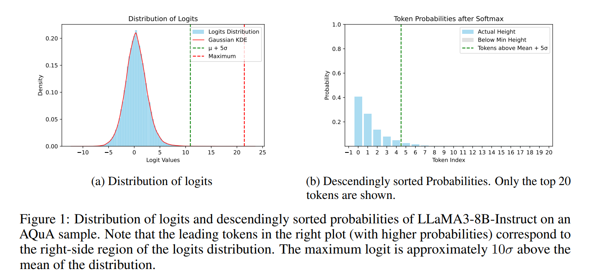

> [!NOTE]
> Our latest evaluation code is maintained in `/dev` branch. Please check it out for the latest updates. This README is outdated.

# Top-NSigma Sampling

This is the official repository for the [Top-nσ sampling](https://arxiv.org/pdf/2411.07641) algorithm. The repository aims to provide a working implementation of the algorithm and collect empirical data with help from the community. We encourage you to try it out and share your feedback!

---

## Overview

Top-nσ is a novel sampling method for language models that truncates the probability distribution based on standard deviations from the maximum logit value. It exhibits superior performance in terms of quality and diversity compared to existing sampling methods.



> [!TIP]
> One of the major advantages of Top-nσ is its extremely simple implementation - requiring as little as two lines of PyTorch code.
>
> Based on our experience, only min-p has comparable speed, while other methods show noticeable throughput loss(with inferior quality).

### Findings

Our research shows that the logits(instead of probabilities) distribution can be divided into two parts: 

1. **Noisy Region** 📊: A Gaussian distribution containing the majority of tokens.
2. **Informative Region** ✨: A uniform(we assume) distribution containing tokens with high semantic relevance.



By inverting conventional outlier detection logic, we treat the **99% tokens as outliers** and truncate them. It works. We also provide theoretical analysis in paper connecting it to popular sampling methods.

> 💡 **Author's note**: Perhaps the most intriguing finding is what I call the "noise of silence" - a fundamental flaw of softmax. To prevent gradient vanishing, the logits cannot be pushed too far apart. For autoregressive models, this limitation appears to be fatal. As long as softmax activation is used, this noise will persist and can only be mitigated through inference-time methods. Yet another evidence that softmax is problematic!


### Usage

We provide two versions of the implementation:

1. HuggingFace version, see in `src/hf/hf_nsigma.py`. You can use it out of the box with HuggingFace Transformers.
2. VLLM version, see in `src/vllm/sampler.py`. You need to apply the ugly hack in `src/vllm/hack.py`. Put it simply, here is how you do it:

```python
import vllm
from hack import hack_vllm, recover_sampler
from sampler import FacadeSampler
model = vllm.LLM(model=path)
hack_vllm(model, FacadeSampler(nsigma, device))
```

> [!NOTE] 
> Due to vLLM's current architecture, we have to use this temporary hack. We're working on merging this properly with the official vLLM codebase.

> [!WARNING] 
> Multi-GPU (tensor-parallelism) support is currently experimental. Testing has primarily been done on single-GPU setups.

## Current Status

We are currently in an early release phase focused on:

1. Providing a functional implementation for the community to experiment with
2. Gathering real-world usage data and feedback
3. Iterating on the algorithm based on community input
4. Adopting the code for multi-gpu usage.

## Future Plans

Once the algorithm stabilizes(with enough empirical data), we will release a fully reproducible version matching the paper, including:

- All random seeds
- Exact parameter configurations 
- Comprehensive evaluation setup

## Contributing

We strongly welcome contributions from the community! Please feel free to:

- Try out the implementation(on different models and tasks) and share your results
- Report issues or suggest improvements
- Contribute code enhancements

Your feedback will help shape the development of Top-$n\sigma$ sampling.

## Citation

If you find this work useful, please consider citing:

```
@misc{tang2024topnsigmalogitsneed,
      title={Top-$n\sigma$: Not All Logits Are You Need}, 
      author={Chenxia Tang and Jianchun Liu and Hongli Xu and Liusheng Huang},
      year={2024},
      eprint={2411.07641},
      archivePrefix={arXiv},
      primaryClass={cs.LG},
      url={https://arxiv.org/abs/2411.07641}, 
}
```